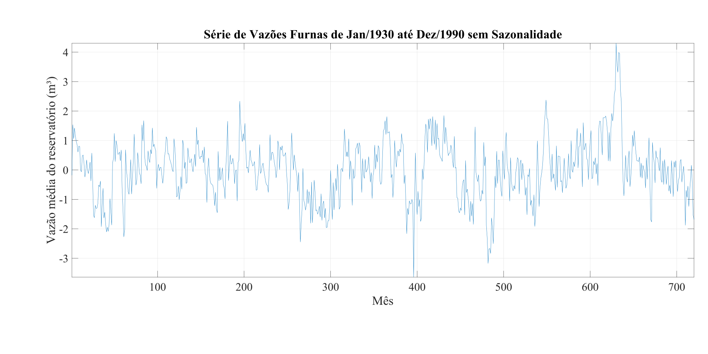

# System Identification

> This repository contains a collection of assignments completed for the *System Identification and Parameter Estimation* (TIP7044) course at the Federal University of Ceará during my Master's degree. 

## Introduction 📖

System Identification and Parameter Estimation is a pivotal discipline across various fields such as Engineering and Science. It enables the quantitative modeling of processes, enhancing our understanding of them, and provides the foundation for predicting future behaviors or controlling these processes. This project applies knowledge from statistical analysis, linear algebra, time series analysis, among other areas, to demonstrate practical applications of these concepts.

## Assignments Description 🗃️

### [Assignment 1](Atividade 1): Statistical Analysis 
- **Description:** Present a sequence of MATLAB commands to determine the mean, variance, and autocorrelation of a series of monthly flow rates of reservoirs for power generation.

### [Assignment 2](Atividade 2): Stationarity and Ergodicity Analysis 
- **Description:** Simulation of a 1st-order AR model, or AR(1), and its statistical characterization by describing its mean, variance, and autocorrelation function (ACF) theoretical values to compare them to its estimations resulted from the simulation.

### [Project 1](TC1): AR(p) Modeling for Flow Rate Series 
- **Description:** The activity consisted of the estimation and identification of the best way to represent the flow rate series data. It involved data normalization, ACF and PACF analysis, OLS and Yule-Walker estimation, and information criterion analysis (AIC/BIC/FPE/MDL).

### [Project 2](TC2): ARX Model Identification 
- **Description:** The activity consisted of the estimation and identification of the best way to represent an artificial dataset. It involved ACF analysis, information criterion analysis, OLS batch and recursive estimation, and RMSE analysis of the residual and prediction error.

### [Project 3](TC3): System Identification Focusing on System Control 
- **Description:** The activity consisted of the estimation and identification of a mass-spring-damper system using an ARX model approach. A PID controller was then designed to control the dynamic system identified for a unit step input.

## License 📄

This project is licensed under the MIT License - see the [LICENSE.md](LICENSE.md) file for details.

## Contact 📬

If you have any questions or suggestions about the project, please feel free to reach out:

- **LinkedIn**: [My LinkedIn Profile](https://www.linkedin.com/in/andreza-nascimento-ce/)
- **Email**: `andrezacosta@alu.ufc.br`
